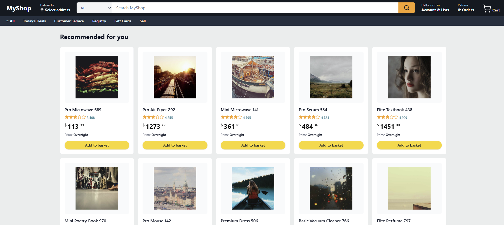

# amazon-but-with-agents



An autonomous shopping agent that definitely won’t bankrupt you (probably).

## 🚀 Overview

**amazon-but-with-agents** is a next-generation e-commerce platform that integrates a powerful AI conversational agent directly into the shopping experience. This project demonstrates how autonomous agents can move beyond simple chat bubbles to actually interacting with and controlling a web interface.

## ✨ Key Features

- **Embedded Conversational Agent**: Search, filter, and add items to your basket using natural language.
- **Visual Action Execution**: Watch as the agent navigates the site, updates your cart, and highlights products in real-time.
- **Hybrid Architecture**: Combines a Python-based reasoning engine (LangGraph) with a modern Next.js frontend.
- **Seamless Basket Management**: Add products to your cart and proceed to checkout with a single command.

## 🏗️ Architecture

- **Backend**: FastAPI server acting as the brains of the operation.
  - **Reasoning**: LangGraph state machine handles complex multi-turn interactions.
  - **Tools**: Direct integration with product search, cart state, and order processing.
- **Frontend**: Next.js 15 application using Tailwind CSS and Radix UI.
  - **Chat Widget**: A floating interface that communicates with the backend via a custom JSON protocol.
  - **Side-Effect Executor**: Processes `ui_actions` from the agent to update the UI state.

## 📂 Project Structure

- `frontend/`: The Next.js web application.
- `backend/`: FastAPI server and database logic.
- `design/`: Architectural blueprints and feature specifications.
- `assets/`: Media assets and screenshots.

## 🛠️ Getting Started

### 1. Prerequisites
- **Node.js**: v18 or higher
- **Python**: 3.11 or higher
- **OpenAI API Key**: (Required for the reasoning engine)

### 2. Setup

#### Backend
```bash
cd backend
python -m venv ../.venv
../.venv/Scripts/activate # or source ../.venv/bin/activate
pip install -r requirements.txt
```

#### Frontend
```bash
cd frontend
npm install
```

### 3. Running the App

The easiest way to start both the frontend and backend is using the provided PowerShell script:

```powershell
./run-dev.ps1
```

Or manually:
- **Backend**: `python backend/main.py` (Runs on `http://localhost:8000`)
- **Frontend**: `cd frontend && npm run dev` (Runs on `http://localhost:3000`)

---

*Note: This project is a demonstration of agentic UI patterns and is not intended for production financial transactions.*
